# The Applied AI Field Guide

> **Fieldwork, value, engineering, and operations for AI that works beyond the demo.**


An open-source design and verification kit for people choosing, building, evaluating, and operating AI in real work: applied-AI engineers, product and workflow owners, service operators, and forward-deployed engineers (FDEs).

[](https://github.com/davidahmann/applied-ai-field-guide/actions/workflows/validate.yml)
[](https://github.com/davidahmann/applied-ai-field-guide/releases/latest)
[](LICENSE)

[Five-minute field guide](guide/field-guide-in-five-minutes.md) · [Complete method](guide/README.md) · [One worked engagement](examples/invoice-exception/engagement/README.md) · [12 Factors of AI Value Engineering](library/14-twelve-factors-ai-value-engineering.md) · [Executive funding guide](guide/funding-ai-for-accepted-outcomes.md)

## Start with the job in front of you

| You need to… | Start here | Leave with |
| --- | --- | --- |
| **Decide where AI could help** | [Discovery and Value](playbooks/01-discovery-and-value.md), then [mechanism selection](library/12-software-architecture-and-intelligence-selection.md) | An observed decision, accepted outcome, verifier, value hypothesis, and simplest plausible mechanism |
| **Find a first workflow** | [First workflow investigation](playbooks/01-discovery-and-value.md#run-a-first-workflow-investigation) and the [discovery pack](templates/discovery-pack.md) | Recent cases, system path, and unknowns—not a quality claim |
| **Build a useful first feature** | [Build one vertical slice](playbooks/02-solution-and-delivery.md#5-build-a-vertical-slice) and try the [invoice review lab](examples/invoice-exception/document-review/README.md) | One bounded path through real inputs, a usable review surface, failure behavior, and test cases |
| **Fix weak retrieval or unsupported answers** | [Context and knowledge systems](library/02-context-and-knowledge-systems.md) and the [retrieval evaluation lab](examples/invoice-exception/retrieval-evaluation/README.md) | Separate evidence for retrieval, source support, permissions, freshness, abstention, latency, and cost |
| **Make a retry or recovery path safe** | [Enterprise integration reality](library/17-enterprise-integration-and-scale-reality.md) and the [durable recovery lab](examples/invoice-exception/durable-recovery/README.md) | A stable operation identity, explicit ambiguity, source-of-truth readback, and an escalation path instead of a duplicated effect |
| **Test a model, prompt, source, or policy change** | [Production evaluation](library/04-production-evaluation-and-governance.md) and [change impact](templates/change-impact-assessment.json) | A bounded claim, representative cases, affected dependencies, rollback conditions, and a release decision |
| **Launch or operate a system** | [Production readiness](templates/production-service-readiness.md) and [production operations](operations/README.md) | The missing evidence or capability, its owner, and a release, repair, constraint, pause, or retirement decision |
| **Rescue a brief that does not match the work** | [Five-minute Guide](guide/field-guide-in-five-minutes.md) and [field engagement and reframing](playbooks/00-field-engagement-and-reframing.md) | One representative case, conflicting claims, a safe fallback, and the person who may decide |
| **Learn by doing** | [Invoice practice packet](examples/invoice-exception/document-review/practice.md) | A source-linked decision, a deliberate failure, a review result, and the limits of the evidence |

## Choose your depth

| Layer | Use it for | Entry |
| --- | --- | --- |
| **The Guide** | The mental model and canonical delivery loop | [Five-minute Guide](guide/field-guide-in-five-minutes.md), then [concise Guide](guide/README.md) |
| **Handbook** | Running a live engagement | [Lifecycle playbooks](playbooks/README.md) |
| **Engineering Kit** | Contracts, controls, architecture, evaluations, operations, and executable evidence | [Templates](templates/README.md), [controls](controls/control-catalog.json), and [examples](examples/invoice-exception/README.md) |

They are not separate frameworks. The [capability roadmap](guide/capability-roadmap.md) is a learning route, not a certification.

## The core idea

Start with the work and the accepted outcome, not a model or agent topology. Compare deterministic software, optimization, classical ML, retrieval, a foundation-model call, a bounded agent workflow, and human review. Choose the smallest mechanism that can safely do the job.

Tokens are an input and autonomy is a design choice. The product is an independently accepted outcome.

Use the [12 Factors](library/14-twelve-factors-ai-value-engineering.md) and [one-page scorecard](guide/ai-value-engineering-scorecard.md) to test the outcome, verifier, adoption, authority, cost, and proof. The [executive funding route](guide/funding-ai-for-accepted-outcomes.md) supports the investment decision.

## See it working

Try the [invoice practice packet](examples/invoice-exception/document-review/practice.md): a messy brief, difficult documents and review rubric. Its [runnable lab](examples/invoice-exception/document-review/README.md) compares rules with optional model proposals.

The [invoice-exception engagement](examples/invoice-exception/engagement/README.md) follows a sold promise that field evidence kills: reframe, economics, controlled-write [runtime](examples/invoice-exception/reference-loop.mjs), retrieval comparison, restart-safe recovery practice, evaluation, blocked handoff, and review-only decision.

The [shipment-risk example](examples/shipment-risk-triage/README.md) combines classical ML, deterministic routing, optional model explanation, and human review.

The [finance variance-commentary walkthrough](examples/finance-variance-commentary/README.md) shows a review-first path: code calculates, owners explain, finance approves the model draft.

```bash
npm ci --ignore-scripts
npm run test:retrieval-evaluation
npm run test:durable-recovery
npm run test:reference
npm run test:evals
npm run test:hybrid
```

These are in-memory teaching systems. Passing tests proves only the declared local behavior—not customer value, production readiness, or deployment approval.

Before adapting them, use [Enterprise Integration and Scale Reality](library/17-enterprise-integration-and-scale-reality.md) to replace teaching conveniences with target evidence.

## From idea to production

The canonical lifecycle:

```mermaid
flowchart LR
    A["Understand the request and workflow"] --> B["Observe and reconcile the work"]
    B --> C["Charter value and scope"]
    C --> D["Make data fit for the decision"]
    D --> E["Select the mechanism"]
    E --> F["Build one controlled slice"]
    F --> G["Prove it with cases and users"]
    G --> H["Launch with operating ownership"]
    H --> I["Operate, learn, or retire"]
```



Each transition needs evidence and an accountable decision. A model score, sponsor, or deadline cannot override a failed value, authority, safety, ownership, or production gate.

Validate a working artifact before it is complete:

```bash
npm run validate:artifact -- ./path/to/workflow-start.json --profile starter --type workflow-charter
npm run validate:artifact -- ./path/to/workflow-charter.json --profile complete
```

The starter profile checks the few fields needed for the current decision while retaining the same canonical types and closed-object rules. It is not a second schema. See [artifact validation](templates/README.md#validate-as-the-decision-matures).

## Start from a business flow

After the workflow and value are accepted, choose a [business-flow pattern](solutions/business-flows/README.md) and, when useful, an [industry profile](solutions/verticals/README.md). The [solution portfolio](solutions/README.md) is a design hypothesis, not target evidence or a deployable product.

## Optional: use it with a coding agent

The guide is complete as documentation. Sixteen optional skills provide focused routes over the same canonical artifacts:

```bash
npx skills add davidahmann/applied-ai-field-guide
```

Pin the source. Skills grant no authority or evidence. Give an agent [AGENTS.md](AGENTS.md).

The [Applied AI Field Guide local plugin](plugins/applied-ai-field-guide/README.md) adds local continuity for sources, revisions, decisions, dependencies, and review packets. Keep restricted content in its approved source system; local execution is not permission to copy it.

Describe the situation in ordinary language and confirm which skill the host selects. The skills cover engagement continuity, workflow qualification, value, data, mechanism selection, design, evaluation, security, release, operation, transfer, and reusable learning.

## Scope and contribution

The control catalog is project policy, not an external compliance standard. Target organizations retain architecture, risk, and release authority.

Contributions should improve an existing route before adding another one. See [CONTRIBUTING.md](CONTRIBUTING.md), [repository maintenance](docs/maintainers/repository-maintenance.md), [security policy](SECURITY.md), the [Apache-2.0 license](LICENSE), and [third-party notices](NOTICE).

## About the maintainer

Created and maintained by [David Ahmann](https://www.linkedin.com/in/dahmann/), a cloud, data, and applied-AI platform leader with Field CTO experience. I’m building the guide to make the decisions behind useful AI systems easier to learn, test, and put into practice. It combines delivery experience, source-linked research, and clearly labeled teaching examples; it is independent work, not employer guidance or endorsement.
