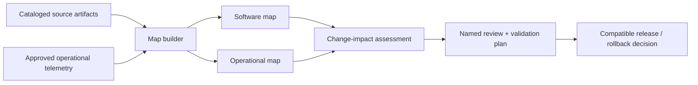

# Evidence Graph and Change Intelligence Blueprint

Use this optional blueprint when a production system spans enough software, data, policy, workflow, and operating components that people cannot reliably see dependency and change consequences from individual documents. It is a navigation and review layer—not a runtime authority system and not a requirement to deploy a graph database.

Do not use it for a small, stable workflow with a single bounded service and clear contracts. Begin with the workflow charter, domain model, source systems, tool contracts, and release bundle. Add a map only when it lowers discovery, onboarding, incident, or change-review cost.

Controls: `ARC-001`, `CTX-001`, `CTX-002`, `CTX-004`, `DEL-001`, `OPS-007`.

## Two map scopes

Maintain separate views when both are useful:

| View | Questions it answers | Typical nodes |
| --- | --- | --- |
| Software map | What is deployed, owned, integrated, and changed together? | Systems, services, repositories, components, interfaces, data products, deployments, runbooks |
| Operational map | Which real decision, evidence, policy, actor, and user surface are affected? | Workflow steps, decisions, sources of truth, policies, tools, owners, evaluations, review surfaces |

The software view can follow C4-style system, container, component, interface, and deployment perspectives. The operational view follows the workflow and domain model. Link the two only through named, versioned evidence.

## Required boundaries

- Treat a map as **derived context**. It must retain source revision, owner, classification, freshness objective, extraction basis, and confidence. `CTX-001`, `CTX-004`.
- Label every relationship as `extracted` or `inferred`. An inferred edge is a review lead, not proof of a dependency or approval obligation.
- For a derived business fact, also retain source references and revisions, producer or extraction configuration, asserted, observed, and effective times, scope, lifecycle status, and correction path. Preserve earlier revisions; a graph record does not overwrite raw evidence or establish source truth.
- Keep source records, authorization policy, effect service, evaluator, and source-of-truth readback authoritative. A map MUST NOT authorize an action, define policy, prove task completion, or replace a release manifest. `ARC-002`, `CTX-002`.
- Apply the same classification, query logging, retention, access, and egress rules as any other derived context. Return task-scoped, progressive projections rather than a company-wide context dump. A graph query result is untrusted data, not instruction authority, causal proof, or state-transition authority. `CTX-002`.
- Store maps as reviewable artifacts or records. A graph database, generated documentation, repository files, and a catalog service are all viable implementations if provenance and access rules hold.

## Build and refresh

1. Register in-scope sources: code/configuration, contracts, catalog metadata, domain models, policy, runbooks, telemetry summaries, and professional work surfaces.
2. Create a [system-map manifest](../templates/system-map-manifest.json) with scope, producer configuration, classification, source revisions, coverage, nodes, relations, and invalidation triggers.
3. Prefer deterministic extraction for interface, repository, deployment, and dependency facts. Use semantic extraction only for unstructured material; keep the model, prompt/configuration, and confidence visible.
4. Reconcile high-consequence inferred links with the named owner or authoritative source before acting on them.
5. Mark the map stale and rebuild it after an input revision, ownership change, new integration, policy change, incident, or scheduled freshness breach. When a source schema or producer changes a derived fact, build a candidate projection alongside the current one, calculate material differences, and route publication, correction, rejection, or unresolved status to the named source or workflow owner.

## Material change review

A material behavior, capability, policy, runtime, data, evaluation, operations, or user-surface change starts with a [change-impact assessment](../templates/change-impact-assessment.json).

The assessment must identify direct and transitive candidates across the two views, distinguish confirmed from inferred impact, name an owner and disposition for each item, and record validation, rollout, rollback, and review evidence. For material or critical changes, incomplete scope or missing technical, operational, and risk review blocks promotion.

Use the map to find what to inspect. Use the compatible release, tests, evaluation, approval, and source-of-truth verification to decide whether to promote. `DEL-001`, `OPS-007`.

## Failure behavior and release tests

| Failure | Required response |
| --- | --- |
| Source is unavailable, stale, or out of scope | Mark the derived map stale; do not silently reuse it for material-change approval |
| Extraction produces an unsupported link | Label it inferred, retain source evidence, and route it to owner review |
| Map contains restricted data | Enforce classification/retention/query controls; remove or rebuild the affected derived artifact |
| Map conflicts with source of truth | Preserve the conflict, use the source of truth for operations, and correct the map |
| Source, schema, or producer change alters a derived fact | Keep the candidate separate, preserve the prior revision, and require the declared owner review before publishing the new status |
| Map service is unavailable | Continue with the governed source artifacts and existing release process; do not bypass authorization or evaluation |

Release tests should cover source-revision capture, derived-fact lifecycle and prior-revision retention, candidate-versus-current material differences, stale-map detection, extraction/inference labeling, path containment, restricted-data handling, material-change coverage, and the guarantee that a map cannot authorize an effect, prove completion, or establish a state transition.

## Evidence

The C4 model supplies a useful hierarchy for software views; Backstage illustrates source-controlled ownership/catalog metadata; OpenLineage provides a job/dataset/run lineage model. Graphify and Understand Anything are implementation leads for local extraction, architecture views, and incremental impact exploration—not proof that an autonomous graph pipeline is required. See [R26-65](../research/2026-02-07--2026-08-07-production-agent-source-ledger.md#r26-65) through [R26-69](../research/2026-02-07--2026-08-07-production-agent-source-ledger.md#r26-69).
